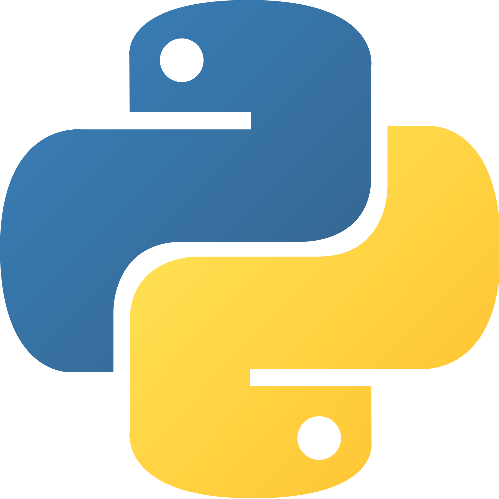

  
  

  <H1> Python, una introducción </H1>

**Notas:** 

* Para abrir los enlaces en un tabulador alterno, utilice: "Ctrl"+click (lamentablemente, GitHub aún carece de una herramienta natural para lograr esto)
* Este curso/repositorio está en constucción permanente, regrese de vez en cuando a ver que cambios encuentra.

## Introducción

### ¿Qué es Python?

Para responder a esta me permito esta [traducción](https://www.python.org/doc/essays/blurb/) y cita textual,

<i>Python es un lenguaje de programación de alto nivel interpretado, orientado a objetos y con semántica dinámica. Sus estructuras de datos integradas de alto nivel, combinadas con la tipificación dinámica y el enlace dinámico, lo hacen muy atractivo para el desarrollo rápido de aplicaciones, así como para su uso como lenguaje de secuencias de comandos o pegamento para conectar componentes existentes entre sí. La sintaxis simple y fácil de aprender de Python enfatiza la legibilidad y, por lo tanto, reduce el costo de mantenimiento del programa. Python admite módulos y paquetes, lo que fomenta la modularidad del programa y la reutilización del código. El intérprete de Python y la extensa biblioteca estándar están disponibles en formato fuente o binario sin cargo para todas las plataformas principales y se pueden distribuir gratuitamente.

A menudo, los programadores se enamoran de Python debido a la mayor productividad que proporciona. Dado que no hay un paso de compilación, el ciclo de edición, prueba y depuración es increíblemente rápido. La depuración de programas de Python es fácil: un error o una entrada incorrecta nunca provocarán una falla de segmentación. En cambio, cuando el intérprete descubre un error, genera una excepción. Cuando el programa no detecta la excepción, el intérprete imprime un seguimiento de la pila. Un depurador a nivel de código fuente permite la inspección de variables locales y globales, la evaluación de expresiones arbitrarias, el establecimiento de puntos de interrupción, el avance paso a paso del código línea a línea, etc. El depurador está escrito en Python mismo, lo que demuestra el poder introspectivo de Python. Por otro lado, a menudo la forma más rápida de depurar un programa es agregar algunas declaraciones de impresión a la fuente: el ciclo rápido de edición, prueba y depuración hace que este enfoque simple sea muy efectivo.</i>

### ¿Por qué [Python](https://www.python.org/)? 

Una manera de responder, algo ingenua, puede reducirse a considerar las siguientes declaraciones acerca del lenguaje:

* [Guido Van Rossum](https://en.wikipedia.org/wiki/Guido_van_Rossum) creador de Python lo diseño para ser *fácilmente* leído por humanos.
* Python es un lenguaje compacto que incluye elementos de los tres principlaes paradigmas de programación: *imperartiva, OOP y programación funcional*.
* La comunidad de usuarios/desarrolladores Python es bastante grnade, de hecho, para fines de 2021, alcanzaba los 10.1 millones de personas.
* Empresas como Google, Netflix, Youtube, Facebook, Instagram, Pinterest y ¡hasta la NASA! utilizan Python para un sinnúmero de aplicaciones.
* Y ... finalmente, el costo: ¡Python es software libre!.

Python tiene algunas idiosincrasias, para empezar, es un lenguaje de propósito general. Es un lenguaje *pequeño*, en el sentido de que carece de cosas como cálculo de raices, funciones trigonométricas, etc. Ahora bien, esas particularidades que alguien de la vieja guardia podría considerar debilidades, constituyen la gran ventaja del lenguaje. En efecto, la enorme comunidad de *pythonistas*, ha desarrollado un conjunto de ecosistemas que convierten a Python en una herramienta extremadamente poderosa. Así, por ejemplo, [Django](https://www.djangoproject.com/), es una biblioteca que permite desarrollo web, [Scipy](https://scipy.org/) es una biblioteca para cálculos científicos y [TensorFlow](https://www.tensorflow.org/) es una de varias herramientas para aprendizaje profundo(Deep Learning). 

Por cierto, si usted desea seguir usando Excel como su herramienta principal para la analítica, Python le permitie extender ampliamente las posibilidades de [Excel](https://www.youtube.com/watch?v=WcDaZ67TVRo). 

### Descripción del curso

Este es un curso muy corto y simplificado cuyo objetivo consiste en construir fundamentos sobre los cuales se pueda profundizar más adelante.

El formato de este curso no requiere ninguna instalación de Python en su máquina, en efecto, el contenido del curso se presenta en términos de *cuadernos jupyter* que corren sobre el recurso cloud [Colab](https://colab.research.google.com/) de google.

Siguiendo la intención de Van Rossum, en ningún momento se presupone que usted deba estar familiarizado con algún lenguaje de programación. 

Si usted tiene abierta una cuenta de Google en su navegador (browser) de preferencia, al abrir cualquiera de los cuadernos de este curso, Google creará para usted una carpeta denominada **Colab Notebooks** que aparecerá en su [Google Drive](https://www.google.com/drive/). Allí se almacenará una copia del cuaderno que usted abrió en primera instancia, copia que puede utilizar a discreción sin temor a estar *dañando algo* de lo que se encuentra en el repositorio original. Si no tiene una cuenta en Google, no podrá guardar su trabajo.

Como he dicho a todos mis estudiantes desde hace más de 30 años, diviértase con lo que está aprendiendo, tómeselo a juego, verá que no hay mejor *mind set* que el de la curiosidad y la libre exploración para aprender, no solo Python, sino cualquier cosa que desee.

## Módulos y Cuadernos del Curso

 [Introducción a Python y sus estructuras de datos nativas](Cuadernos_Jupyter/CL_I_ESTRUCTURAS_DE_DATOS_NATIVAS.ipynb)

[Control del flujo de ejecución](Cuadernos_Jupyter/ESTRUCTURAS_DE_CONTROL.ipynb)

[Funciones en Python](Cuadernos_Jupyter/FUNCIONES_I.ipynb)

## Ejemplos

### **Aprendizaje Automático**

  * [Regresión Lineal Simple](Cuadernos_Jupyter/Intro_Python_fit_line.ipynb)
  * [Agrupamiento (clustering)](Cuadernos_Jupyter/AA_KMEANS_IRIS.ipynb)
  
### **Matemáticas**

  * [Solución numérica de Ecuaciones Diferenciales](Cuadernos_Jupyter/Sol_Num_de_EDO.ipynb)

### Algunas herramientas básicas para analítica de datos

[Python for Data Analysis: Data Wrangling with Pandas, NumPy, and IPython 2nd Edition](https://www.amazon.com/Python-Data-Analysis-Wrangling-IPython-ebook/dp/B075X4LT6K). Este libro, escrito por [Wes McKinney](https://en.wikipedia.org/wiki/Wes_McKinney), es, muy posiblemente la mejor referencia de Python que este servidor de ustedes haya encontrado, lo recomiendo sin la menor reserva.

[Numpy](https://numpy.org/) Esta es la biblioteca básica de cálculo numérico, incluye un conjunto importante de estructuras de datos diseñadas ad hoc, como por ejemplo arreglos (matrices) y operaciones entre ellas.

[Matplotlib](https://matplotlib.org/) es el núcleo de graficación para Python, es sumamente sencillo de usar y su sintaxis es muy similar a la sintaxis gráfica de matlab.
Cuadernos_Jupyter/Sol_Num_de_EDO.ipynb
[Seaborn](https://seaborn.pydata.org/) es una biblioteca de visualización basada en matplotlib que permite crear gráficos de una altísima calidad.

[Pandas](Cuadernos_Jupyter/Introduccion_a_PANDAS.ipynb) esta biblioteca es el núcleo del ecosistema de **Ciencia de Datos**, con sus dos estructuras de datos básicas, **Pandas Series** y **DataFrames**, permite leer, manipular y escribir tablas de datos de muy diveros orígenes y formatos, incluyendo, evidentemente, archivos csv y xls.

[scikit-learn](https://scikit-learn.org/stable/) Esta biblioteca contiene módulos para una plétora de técnicas de **Machime Learning**, incluyendo, entre muchas otras, regresiones lineales y logística, algoritmos de agrupamiento (**clustering**) y mi clasificador predilecto, **Naive Bayes**.

[TensorFlow](https://www.tensorflow.org/) Esta es una biblioteca fundamental para aprendizaje profundo (**Deep Learning** o DL), permite definir topologías de redes neuronales para diferentes aplicaciones, especificar las funciones de activación, las métricas de aprendizaje, escoger los algoritmos de optimización y afinar los hiperparámateros. La versión 2 (es la versión actual) incorpora [keras](https://keras.io/) una API que facilita enormemente el uso de TensorFlow. El libro [Deep Learning With Python](https://www.amazon.com/Deep-Learning-Python-Fran%C3%A7ois-Chollet-ebook/dp/B0977ZRV1J/ref=sr_1_1?crid=8UDWCXZEOT12&keywords=chollet&qid=1648140865&s=digital-text&sprefix=chollet%2Cdigital-text%2C198&sr=1-1) de [Francois Chollet](https://en.wikipedia.org/wiki/Fran%C3%A7ois_Chollet), creador de Keras, es probablemente, la referencia fundamental para entrar al mundo del DL.

## Recursos Cloud

* Si desea tener una insatlación local de Python, le recomiendo que descarge [Anaconda](https://www.anaconda.com/), un ambiente que le permitirá tener acceso a todo el ecosistema de bibliotecas de Python.
* [RealPython](https://realpython.com/) contiene una cantidad importante de tutoriales.
* Si le interesa la ciencia de datos (CD), [kaggle](https://wwCuadernos_Jupyter/Sol_Num_de_EDO.ipynbw.kaggle.com/) una comunidad dedicada a la CD, ofrece cursos y proyectos con datos reales que le permitirán entrenarse hasta alcanzar un muy buen nivel. 

